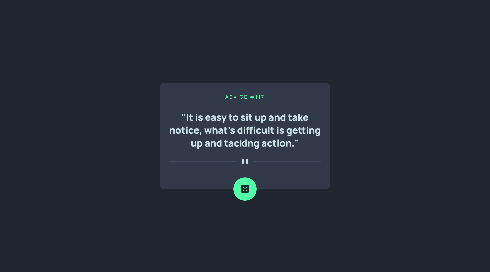

# Frontend Mentor - Advice generator app solution

This is a solution to the [Advice generator app challenge on Frontend Mentor](https://www.frontendmentor.io/challenges/advice-generator-app-QdUG-13db). Frontend Mentor challenges help you improve your coding skills by building realistic projects.

## Table of contents

- [Overview](#overview)
  - [The challenge](#the-challenge)
  - [Screenshot](#screenshot)
  - [Links](#links)
- [My process](#my-process)
  - [Built with](#built-with)
  - [What I learned](#what-i-learned)
  - [Useful resources](#useful-resources)
- [Author](#author)


## Overview

### The challenge

Users should be able to:

- View the optimal layout for the app depending on their device's screen size
- See hover states for all interactive elements on the page
- Generate a new piece of advice by clicking the dice icon


### Screenshot




### Links

- Solution URL: [https://github.com/Makson19/advice-generator-app](https://github.com/Makson19/advice-generator-app)
- Live Site URL: [Add live site URL here](https://your-live-site-url.com)

## My process

### Built with

- Semantic HTML5 markup
- CSS custom properties
- Sass
- Flexbox
- Mobile-first workflow


### What I learned

In this project I was able to learn how to use the data coming from an API using fetch, async and await from JavaScript.

Below is a snippet of the code I used to solve this project:

```js
async function adviceGenerator() {
    const url = "https://api.adviceslip.com/advice";

    const response = await fetch(url);
    const data = await response.json();
    
    showDevice(data);
}
```


### Useful resources

- [Advice Slip JSON API](https://api.adviceslip.com/) - API used in the project.
- [Como consumir uma API de CEP com JavaScript puro](https://www.youtube.com/watch?v=imk6Y0viabg&t=952s&ab_channel=FernandoLeonid) - It was through this video that I was able to learn how to consume an API using JavaScript.


## Author

- Frontend Mentor - [@Makson19](https://www.frontendmentor.io/profile/Makson19)
- Github - [Makson19](https://github.com/Makson19)
- Codepen - [@Makson19](https://codepen.io/Makson19)

